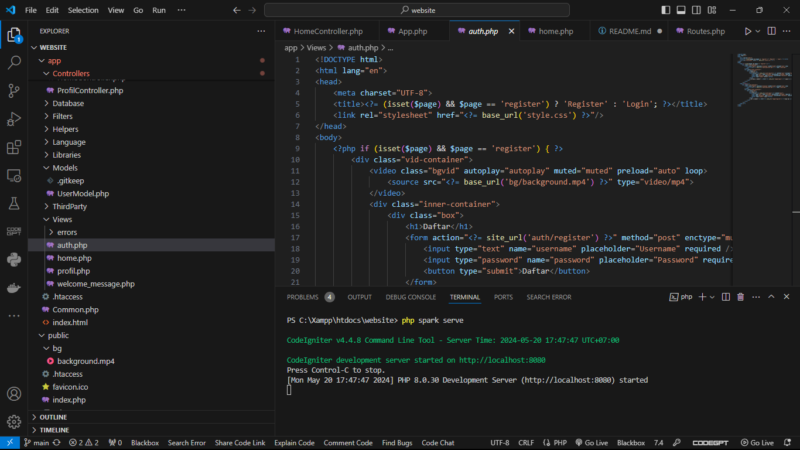

# UTS Pemrograman Web 2

Nama : Syahbarudin Abdillah

NIM  : 312210656

Kelas : TI.22.A1

## DAFTAR ISI  
| No | Description | Link |
|-----|------|-----|
|1|Instruksi Praktikum|[Click Here](#instruksi-menjalankan)|
|2|Hasil Praktikum|[Click Here](#Hasilnya)|

## Intruksi Menjalankan
#cd > direktori kerja project dibuat

Perintah yang dapat dijalankan untuk memanggil CLI Codeigniter adalah: php spark serve

## Hasilnya

ini hasil dari programnya

https://github.com/syahbarudin/UTS_Web2-with-CI4/assets/146621192/e5e0c583-5d76-49df-99fe-b294c96bb6e0
